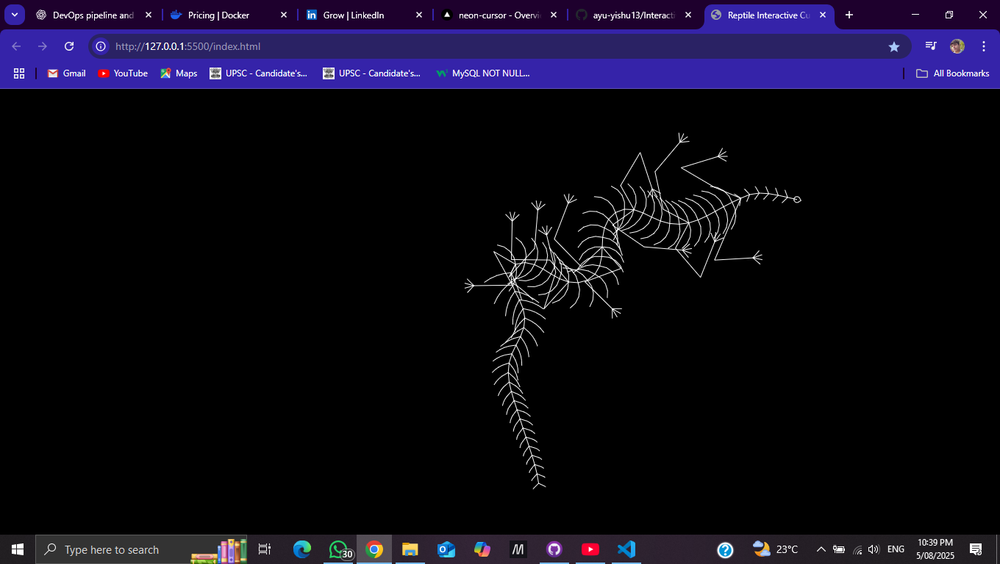

# 🦎 Mouse Interactive Reptile

A fun and interactive front-end project where a **reptile or creature follows your mouse cursor** across the screen. This animation adds a playful and dynamic touch to any website using **HTML, CSS, and JavaScript**.

## 🧩 Features

- Reptile or shape tracks mouse movement smoothly
- Real-time interactivity
- Clean, responsive visuals
- Simple implementation without external libraries

## 🛠️ Technologies Used

- **HTML** – Page markup structure
- **CSS** – Reptile appearance and motion styling
- **JavaScript** – Mouse tracking and animation logic

## 📷 Screenshot

  
> 💡 Replace this with your actual screenshot image

## 🚀 Getting Started

Clone the repository and open the `index.html` in any browser.

```bash
git clone https://github.com/ayu-yishu13/Interactive-Reptile.git
cd mouse-interactive-reptile
Then open index.html in your preferred browser.

📁 Project Structure
r
Copy
Edit
mouse-interactive-reptile/
│
├── index.html       # Main HTML page
├── style.css        # Styling for the reptile and layout
├── script.js        # Mouse movement and logic
└── scrrenshot.png   # Demo screenshot 
🧠 How It Works
JavaScript captures mouse movement

The "reptile" element moves toward the cursor with delay, mimicking life-like following behavior

CSS brings the visual design to life with transitions

🎯 Use Cases
Creative developer portfolios

Kids' websites or educational pages

Gamified UI interfaces

🙌 Acknowledgements
Inspired by creative cursor animations and interactive web UI trends.

📃 License
This project is released under the MIT License.

